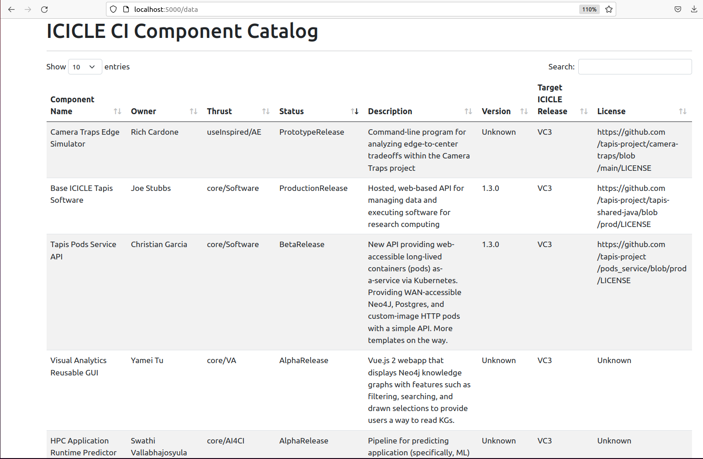

# CI Components Catalog

## Introduction

This repository contains metadata and code for the ICICLE CI Components Catalog. The CI Components Catalog tracks all major
products developed by the ICICLE AI Institute. Using the Catalog, members within ICICLE as well as their collaborators and
the general public can learn about the products being produced. 

## Schema

We are using LinkML and JSONSchema to describe the data model associated with components in the catalog. 
The JSONSchema document can be generated from the LinkML yaml document by doing the following:

```
$ docker run -v $(pwd):/work  -w /work/ --rm -it jstubbs/linkml gen-json-schema ci-component.yaml

```

You can test the schema by validating the local example dataset ``components-data.yaml``, 
included in the repository, by doing the following:

```
docker run -v $(pwd):/work  -w /work/ --rm -it jstubbs/linkml linkml-validate -sci-component.yaml components-data.yaml
```

If no errors are returned, the message ``None`` will be output. 


## Deploying the Catalog Locally

A simple prototype application is being developed with Flask and Docker. You need to install
Docker on your computer before trying to run the application locally. See the [Docker 
documentation](https://docs.docker.com/get-docker/) for information about how to get Docker on your platform.

You can deploy the prototype locally using one of the following methods:

### Using Make

If you have GNU make on your computer, issuing the following command should build the
application image and start the container in one go:

```
make run
```


### Building with Docker

One can build the container image using a command such as:

```
docker build -t tapis/ci-catalog .
```

With the image build, start the application using:

```
docker run --name catalog --rm -p 5000:5000 tapis/ci-catalog
```

## Application URLs

With the application deployed locally, navigate to ``localhost:5000/data`` to see the 
catalog.




### Authentication with Tapis

The CI Components Catalog is designed to use Tapis authentication and authorization. Certain
components in the catalog are restricted to members of ICICLE.

In order to leverage Tapis auth in the catalog running locally, you need to configure it
with a Tapis OAuth client. Generating an OAuth client can be done following the steps 
below; see the [docs](https://tapis.readthedocs.io/en/latest/technical/authentication.html#oauth-clients) for more details.


#### Create an OAuth Client (One Time Setup)
First, generate a JWT and export it to the environment:

```
curl -H "Content-type: application/json" -d '{"username": "your_username", "password": "your_password", "grant_type": "password" }' https://icicle.tapis.io/v3/oauth2/tokens

export JWT=eyJ0eXAiOiJK....
```

Use the token to register an OAuth client:
```
curl -H "X-Tapis-Token: $JWT" -H "Content-type: application/json" -d '{"client_id": "ci-comps-test", "callback_url": "http://localhost:5000/oauth2/callback", "client_key": "icicle4ever"}' https://icicle.tapis.io/v3/oauth2/clients
```

#### Configure the Catalog to Use the Client

The catalog needs to be configured with the client id and key to work with Tapis OAuth.
Simply add the id and key to the ``config.yaml`` file.


